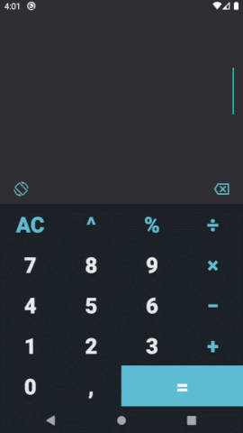

# Description
Android calculator app, developed for learning purposes.

# Dependencies
* DataBinding and ViewBinding

        buildFeatures { 
            viewBinding true
            dataBinding true
        }

* ViewModel

        androidx.lifecycle:lifecycle-viewmodel-ktx:2.3.1
        androidx.lifecycle:lifecycle-extensions:2.2.0

* Expression Parser

        net.objecthunter:exp4j:0.4.8

# Screenshots

